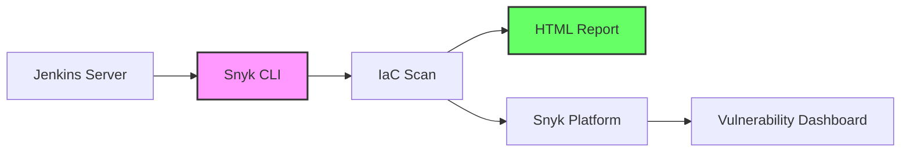
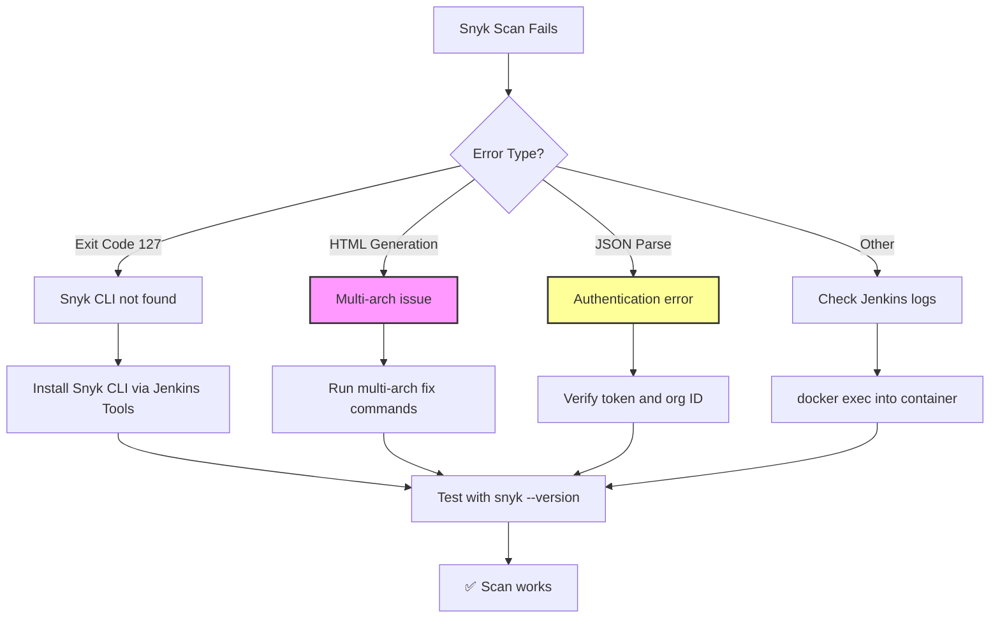

# Snyk Security Scan Integration Runbook

## Jenkins + Snyk Configuration → IaC Scanning → Multi-Arch Fix

### Overview



This runbook covers integrating Snyk security scanning into your Jenkins pipeline, with specific focus on IaC (Infrastructure as Code) scanning and troubleshooting the ARM64/x86_64 compatibility issue on Mac M-series hardware.

---

## Prerequisites

| Prerequisite    | Verification                 | Notes                       |
|-----------------|------------------------------|-----------------------------|
| Snyk Account    | <https://app.snyk.io>        | Free tier available         |
| Snyk API Token  | Account Settings → API Token | Starts with `snyk-` or UUID |
| Snyk Org ID     | Settings → General → Org ID  | UUID format                 |
| Jenkins Server  | <http://localhost:8080>      | Docker or EC2               |
| Terraform Files | `*.tf` in repository         | For IaC scanning            |

---

## Part 1: Snyk Account Setup

### 1.1 Get Your Snyk API Token

1. Log into [Snyk](https://app.snyk.io)
2. Click your avatar → **Account Settings**
3. Under **API Token**, copy your token
4. Save it securely

```text
Example Token: snyk-abc123def456...
```

### 1.2 Get Your Organization ID

1. In Snyk, click **Settings** (gear icon)
2. Go to **General**
3. Copy the **Org ID** (looks like a UUID)

```text
Example Org ID: 68b20daa-ce82-4b0c-aefd-1ed44c05958e
```

### 1.3 Create Personal Access Token (Alternative)

Snyk also supports Personal Access Tokens (PAT):

1. Account Settings → **Personal Access Tokens**
2. Click **Add Token**
3. Set expiration and scopes
4. Copy the generated token

---

## Part 2: Configure Snyk in Jenkins

### 2.1 Install Snyk CLI via Jenkins Tools

1. Go to **Manage Jenkins → Tools**
2. Scroll to **Snyk Installations**
3. Click **Add Snyk**
4. Configure:

| Field                     | Value                          |
|---------------------------|--------------------------------|
| **Name**                  | `snyk` (must be lowercase)     |
| **Install automatically** | ✅ Check                       |
| **Version**               | `linux amd64` (for Docker/EC2) |
| **Update policy**         | `24`                           |

1. Click **Save**

### 2.2 Alternative: Manual Snyk Installation in Container

```bash
# Exec into container
docker exec -it --user root devsecops-sandbox bash

# Install Snyk CLI
curl -sL https://static.snyk.io/cli/latest/snyk-linux -o snyk
chmod +x snyk
mv snyk /usr/local/bin/

# Verify
snyk --version
```

### 2.3 Add Snyk Credentials in Jenkins

1. Go to **Manage Jenkins → Manage Credentials → Global → Add Credentials**

#### Credential 1: API Token (for plugin)

| Field                     | Value                          |
|---------------------------|--------------------------------|
| **Kind**                  | Snyk Api Token                 |
| **ID**                    | `snyk-api-token`               |
| **Token**                 | Your Snyk API token            |

#### Credential 2: API Token String (for CLI)

| Field                     | Value                          |
|---------------------------|--------------------------------|
| **Kind**                  | Secret text                    |
| **ID**                    | `snyk-api-token-string`        |
| **Secret**                | Your Snyk API token            |

#### Credential 3: Organization Slug

| Field                     | Value                          |
|---------------------------|--------------------------------|
| **Kind**                  | Secret text                    |
| **ID**                    | `snyk-org-slug`                |
| **Secret**                | Your Snyk Org ID (UUID)        |

---

## Part 3: Jenkinsfile with Snyk Stages

### 3.1 Complete Jenkinsfile Example

```groovy
pipeline {
    agent any

    environment {
        AWS_DEFAULT_REGION = 'us-east-1'
        TF_IN_AUTOMATION = 'true'
        SNYK_ORG = credentials('snyk-org-slug')
    }

    stages {
        stage('Checkout') {
            steps {
                checkout scm
            }
        }

        // --------------------------------------------------------------------
        // STAGE: Snyk IaC Scan Test (CLI Method)
        // --------------------------------------------------------------------
        // Tests infrastructure code using Snyk CLI. 
        // The || true ensures pipeline continues even if issues found.
        // --------------------------------------------------------------------
        stage('Snyk IaC Scan Test') {
            steps {
                withCredentials([string(credentialsId: 'snyk-api-token-string', variable: 'SNYK_TOKEN')]) {
                    sh '''
                        # Use pre-installed Snyk or install if needed
                        if command -v snyk &> /dev/null; then
                            SNYK_CMD="snyk"
                        else
                            SNYK_CMD="/var/lib/jenkins/tools/io.snyk.jenkins.tools.SnykInstallation/snyk/snyk-linux"
                        fi
                        
                        # Authenticate
                        $SNYK_CMD auth $SNYK_TOKEN
                        
                        # Run IaC test
                        $SNYK_CMD iac test --org=$SNYK_ORG --severity-threshold=high || true
                    '''
                }
            }
        }

        // --------------------------------------------------------------------
        // STAGE: Snyk IaC Scan Monitor (Plugin Method)
        // --------------------------------------------------------------------
        // Runs Snyk scan and reports results to Snyk platform.
        // Generates HTML report for local viewing.
        // --------------------------------------------------------------------
        stage('Snyk IaC Scan Monitor') {
            steps {
                snykSecurity(
                    snykInstallation: 'snyk',
                    snykTokenId: 'snyk-api-token',
                    additionalArguments: '--iac --report --org=$SNYK_ORG --severity-threshold=high',
                    failOnIssues: false,  // Don't fail pipeline on findings
                    monitorProjectOnBuild: false
                )
            }
        }

        // --------------------------------------------------------------------
        // STAGE: Terraform Init
        // --------------------------------------------------------------------
        stage('Terraform Init') {
            steps {
                withCredentials([[
                    $class: 'AmazonWebServicesCredentialsBinding',
                    credentialsId: 'aws-iam-user-creds'
                ]]) {
                    sh 'terraform init -reconfigure'
                }
            }
        }

        // --------------------------------------------------------------------
        // STAGE: Terraform Plan
        // --------------------------------------------------------------------
        stage('Terraform Plan') {
            steps {
                withCredentials([[
                    $class: 'AmazonWebServicesCredentialsBinding',
                    credentialsId: 'aws-iam-user-creds'
                ]]) {
                    sh 'terraform plan'
                }
            }
        }

        // --------------------------------------------------------------------
        // STAGE: Optional Destroy
        // --------------------------------------------------------------------
        stage('Optional Destroy') {
            steps {
                script {
                    def destroyChoice = input(
                        message: 'Do you want to run terraform destroy?',
                        ok: 'Submit',
                        parameters: [
                            choice(
                                name: 'DESTROY',
                                choices: ['no', 'yes'],
                                description: 'Select yes to destroy resources'
                            )
                        ]
                    )

                    if (destroyChoice == 'yes') {
                        withCredentials([[
                            $class: 'AmazonWebServicesCredentialsBinding',
                            credentialsId: 'aws-iam-user-creds'
                        ]]) {
                            sh 'terraform destroy -auto-approve'
                        }
                    } else {
                        echo "Skipping destroy"
                    }
                }
            }
        }
    }

    post {
        success {
            echo '✅ Pipeline completed successfully!'
        }
        failure {
            echo '❌ Pipeline failed!'
        }
    }
}
```

### 3.2 Stage Analysis

| Stage                     | Purpose                       | Key Parameters                           |
|---------------------------|-------------------------------|------------------------------------------|
| **Snyk IaC Scan Test**    | CLI-based test                | `--severity-threshold=high`, `\|\| true` |
| **Snyk IaC Scan Monitor** | Plugin-based scan + reporting | `--report`, `failOnIssues: false`        |
| **Terraform Init**        | Backend configuration         | `-reconfigure` flag                      |
| **Terraform Plan**        | Preview changes               | `-out=tfplan`                            |
| **Optional Destroy**      | Cleanup                       | Manual approval required                 |

---

## Part 4: Multi-Arch Fix (Mac M-Series / ARM64)

### 4.1 The Problem

On Mac M-series (ARM64) running Jenkins in Docker, the Snyk HTML generator (`snyk-to-html-linux`) fails with:

```text
OrbStack ERROR: Dynamic loader not found: /lib64/ld-linux-x86-64.so.2
```

**Cause:** The binary is x86_64 (Intel) but running on ARM64 without multi-arch libraries.

### 4.2 The Fix: Install Multi-Arch Libraries

```bash
# Step 1: Exec into container as root
docker exec -it --user root devsecops-sandbox bash

# Step 2: Enable amd64 architecture
dpkg --add-architecture amd64

# Step 3: Update package lists
apt-get update

# Step 4: Install x86_64 compatibility libraries
apt-get install -y libc6:amd64 libstdc++6:amd64

# Step 5: Verify dynamic linker exists
ls -la /lib64/ld-linux-x86-64.so.2
# Should show: lrwxrwxrwx ... -> ../lib/x86_64-linux-gnu/ld-linux-x86-64.so.2

# Step 6: Test HTML generator
/var/jenkins_home/tools/io.snyk.jenkins.tools.SnykInstallation/snyk/snyk-to-html-linux --help
# Should show help text, not the OrbStack error
```

### 4.3 Verify the Fix

```bash
# Test full scan with HTML generation
/var/jenkins_home/tools/io.snyk.jenkins.tools.SnykInstallation/snyk/snyk-linux auth $SNYK_TOKEN
/var/jenkins_home/tools/io.snyk.jenkins.tools.SnykInstallation/snyk/snyk-linux iac test --json --report --severity-threshold=high

# Test HTML generation separately
/var/jenkins_home/tools/io.snyk.jenkins.tools.SnykInstallation/snyk/snyk-to-html-linux --help
```

### 4.4 Quick Fix Summary (Copy-Paste)

```bash
# One-liner to fix multi-arch on Mac M-series
docker exec -it --user root devsecops-sandbox bash -c "dpkg --add-architecture amd64 && apt-get update && apt-get install -y libc6:amd64 libstdc++6:amd64 && echo '✅ Multi-arch libraries installed'"
```

---

## Part 5: Common Snyk Errors and Fixes

### 5.1 Exit Code 127 (Command Not Found)

```text
ERROR: script returned exit code 127
snyk-linux: not found
```

**Cause:** Snyk CLI not installed or not in PATH.

**Fix:**

- Install Snyk via Jenkins Tools (Part 2.1)
- Or use full path: `/var/lib/jenkins/tools/io.snyk.jenkins.tools.SnykInstallation/snyk/snyk-linux`

### 5.2 JSON Parse Error

```text
JsonParseException: Unrecognized token 'FailedToGetIacOrgSettingsError'
```

**Cause:** Snyk returned plain text error instead of JSON (authentication issue).

**Fix:**

- Verify Snyk API token is correct
- Check organization ID is valid
- Ensure token has proper permissions

### 5.3 HTML Report Generation Failed

```text
FATAL: Snyk Security scan failed. Failed to generate report.
```

**Cause:** Multi-arch issue on ARM64 or missing dependencies.

**Fix:** Follow Part 4 (Multi-Arch Fix)

### 5.4 No Manifest File

```text
Snyk code can't be scanned unless there's a manifest file.
```

**Fix:** For IaC scanning, use `--iac` flag. Set `monitorProjectOnBuild: false` when scanning infrastructure.

---

## Part 6: Troubleshooting Flow



---

## Part 7: Day-to-Day Security Operations

### 7.1 Common Developer Questions

| Question                                | Answer                                                                        |
|-----------------------------------------|-------------------------------------------------------------------------------|
| "Why is my build failing?"              | Snyk found a vulnerability. Check the report for details.                     |
| "How do I fix a transitive dependency?" | Pin the vulnerable dependency in your requirements file.                      |
| "What's a false positive?"              | Sometimes scanners flag safe code. Review and mark as ignored if appropriate. |
| "Can I skip this vulnerability?"        | Yes, but document why. Use `--exclude` or `--ignore` with justification.      |

### 7.2 Common Vulnerabilities

| Type                      | Example                      | Fix                                          |
|---------------------------|------------------------------|----------------------------------------------|
| **Hardcoded Secret**      | `API_KEY = "abc123"`         | Use environment variables or secrets manager |
| **Command Injection**     | `os.system(user_input)`      | Validate inputs, use parameterized calls     |
| **SQL Injection**         | `f"SELECT * FROM {table}"`   | Use parameterized queries                    |
| **Outdated Dependency**   | `urllib3==1.0`               | Update to patched version                    |
| **Transitive Dependency** | Library A → Library B (vuln) | Pin Library B to safe version                |

### 7.3 SCA Vs SAAS

| Scan Type | Full Name                           | Purpose                                               | Tools                 |
|-----------|-------------------------------------|-------------------------------------------------------|-----------------------|
| **SCA**   | Software Composition Analysis       | Checks dependencies for known vulnerabilities         | Snyk, OWASP DC, Trivy |
| **SAST**  | Static Application Security Testing | Analyzes source code for security flaws               | SonarQube, Checkmarx  |
| **IaC**   | Infrastructure as Code              | Scans Terraform, CloudFormation for misconfigurations | Snyk IaC, Checkov     |

---

## Part 8: Webhook Integration (Jenkins + GitHub)

### 8.1 Your Webhook URL Template

```text
https://{your-jenkins-url}/github-webhook/
```

### 8.2 Examples by Environment

| Environment              | Webhook URL                                                      |
|--------------------------|------------------------------------------------------------------|
| **Local Docker + ngrok** | `https://joni-flooded-improbably.ngrok-free.dev/github-webhook/` |
| **AWS EC2**              | `http://54.123.45.67:8080/github-webhook/`                       |
| **Production**           | `https://jenkins.yourcompany.com/github-webhook/`                |

### 8.3 Start Ngrok Tunnel (Docker Only)

```bash
ngrok http 8080
```

Copy the forwarding URL: `https://your-subdomain.ngrok-free.dev`

> [!IMPORTANT]
> Each time you restart ngrok, you get a new URL. Update it in GitHub webhook settings.

---

## Part 9: Quick Commands Reference

### Snyk CLI Commands

```bash
# Authenticate
snyk auth $SNYK_TOKEN

# Run IaC test
snyk iac test --org=$SNYK_ORG --severity-threshold=high

# Run IaC test with JSON output
snyk iac test --json --report

# Run IaC test with HTML report
snyk iac test --json --report | snyk-to-html -o report.html

# Test specific file
snyk iac test main.tf

# Set organization
snyk config set org=$SNYK_ORG

# Check version
snyk --version
```

### Container Commands

```bash
# Exec into container as root (Mac fix)
docker exec -it --user root devsecops-sandbox bash

# Get Jenkins admin password
docker exec devsecops-sandbox cat /var/jenkins_home/secrets/initialAdminPassword

# Check Jenkins logs
docker logs devsecops-sandbox -f

# Install multi-arch libraries
docker exec -it --user root devsecops-sandbox bash -c "dpkg --add-architecture amd64 && apt-get update && apt-get install -y libc6:amd64 libstdc++6:amd64"
```

---

## Part 10: Study References

### Snyk Documentation

| Resource                | Description                          | Link                                                                                                                                             |
|-------------------------|--------------------------------------|--------------------------------------------------------------------------------------------------------------------------------------------------|
| **Snyk CLI**            | Command-line interface documentation | [docs.snyk.io/snyk-cli](https://docs.snyk.io/snyk-cli)                                                                                           |
| **IaC Scanning**        | Infrastructure as Code scanning      | [docs.snyk.io/products/snyk-infrastructure-as-code](https://docs.snyk.io/products/snyk-infrastructure-as-code)                                   |
| **API Token**           | Creating and managing tokens         | [docs.snyk.io/features/account-management/managing-account-settings](https://docs.snyk.io/features/account-management/managing-account-settings) |
| **Snyk Jenkins Plugin** | Plugin documentation                 | [plugins.jenkins.io/snyk-security-scanner/](https://plugins.jenkins.io/snyk-security-scanner/)                                                   |

### Jenkins Documentation

| Resource                | Description                    | Link                                                                                                                 |
|-------------------------|--------------------------------|----------------------------------------------------------------------------------------------------------------------|
| **Pipeline Syntax**     | Declarative pipeline reference | [jenkins.io/doc/book/pipeline/syntax/](https://www.jenkins.io/doc/book/pipeline/syntax/)                             |
| **Credentials Binding** | Secure credential injection    | [jenkins.io/doc/pipeline/steps/credentials-binding/](https://www.jenkins.io/doc/pipeline/steps/credentials-binding/) |
| **Tools Configuration** | Installing tools via Jenkins   | [jenkins.io/doc/book/managing/tools/](https://jenkins.io/doc/book/managing/tools/)                                   |

### Multi-Arch / Linux

| Resource                | Description                  | Link                                                           |
|-------------------------|------------------------------|----------------------------------------------------------------|
| **Debian Multi-Arch**   | Multi-architecture support   | [wiki.debian.org/Multiarch](https://wiki.debian.org/Multiarch) |
| **libc6:amd64**         | x86_64 compatibility library | [packages.debian.org/libc6](https://packages.debian.org/libc6) |
| **OrbStack Multi-Arch** | OrbStack architecture guide  | [orb.cx/multiarch](https://orb.cx/multiarch)                   |

---

## Quick Reference Card

| Task                    | Command / Location                                                |
|-------------------------|-------------------------------------------------------------------|
| **Snyk Token**          | Account Settings → API Token                                      |
| **Org ID**              | Settings → General → Org ID                                       |
| **Jenkins Credentials** | Manage Jenkins → Manage Credentials                               |
| **Jenkins Tools**       | Manage Jenkins → Tools → Snyk Installations                       |
| **Multi-Arch Fix**      | `dpkg --add-architecture amd64 && apt-get install -y libc6:amd64` |
| **Test Snyk**           | `snyk iac test --org=$SNYK_ORG`                                   |
| **Webhook URL**         | `https://{jenkins-url}/github-webhook/`                           |
| **Ngrok Tunnel**        | `ngrok http 8080`                                                 |

---

**Remember:** Security is a continuous process. Scans will fail. Developers will push vulnerable code. Your role is to educate, automate, and protect sensitive information. Developers may view this as blocking progress, but the tension between "it works" and "it's secure" is expected and normal.
